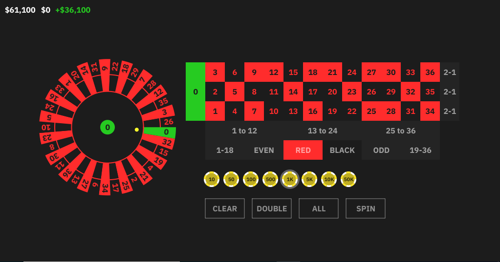

# Rūretto

Rūretto is a 2D implementation of the classic casino game, developed using the [Tender](https://github.com/2dprototype/tender-free) language, which is specially designed for developing 2D games. This project is open source and available for contributions and modifications.

## Introduction

This project is a simple yet engaging simulation of the roulette game, developed as a showcase of the capabilities of the Tender language.

## Preview



## Installation

To run this game, you will need to have the Tender-Free interpreter installed on your machine. Follow the instructions below to get started:

1. Clone the repository:
    ```sh
    git clone https://github.com/2dprototype/Ruretto.git
    cd Ruretto
    ```

2. Install [Tender](https://github.com/2dprototype/tender-free) on your machine.

3. Run the roulette game:
    ```sh
    tender main.td
    ```

## License

This project is licensed under the MIT License - see the [LICENSE](LICENSE) file for details.

## Message

Bet all on Zero like a true gambler!
